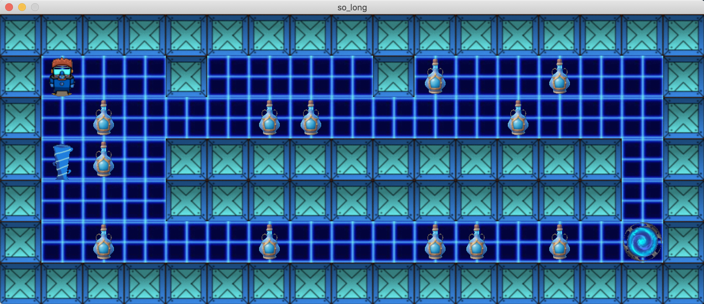
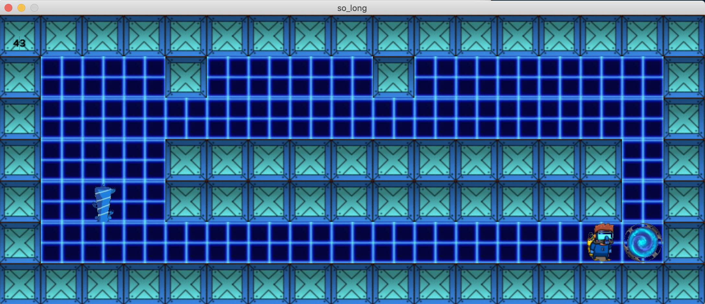

# so_long

## Overview
**so_long** is a small 2D game project where the player moves through a grid-based map to collect items and reach an exit while avoiding obstacles. This project introduces you to graphical programming using the **MiniLibX** library and teaches you how to manage game loops, user input, and basic rendering techniques.




---

## Features
- Render a 2D grid-based map using textures (XPM files).
- Player movement controlled via keyboard input.
- Collectibles scattered throughout the map.
- An exit that becomes accessible only after all collectibles are gathered.
- Basic error handling for invalid maps or inputs.
- Cross-platform compatibility on macOS and Linux using MiniLibX.

---

## Installation
1. Clone the repository:
   ```bash
   git clone https://github.com/your-username/so_long.git
   cd so_long
2. Build the project:
   ```bash
   make
   ```
This will generate the so_long executable.

## Usage

Run the program with a valid map file as an argument:
   ```bash
   ./so_long maps/example_map.ber
   ```
**Controls**
- W / ↑: Move up
- A / ←: Move left
- S / ↓: Move down
- D / →: Move right
- ESC: Quit the game

**Map Format**

Example of a Valid Map (.ber file):
   ```bash
   111111
   100C01
   10P001
   10E001
   111111
   ```

### Rules for Map Design:
   1- The map must be rectangular.

   2- The map must be surrounded by walls (1).

   3- Must contain:
   - At least one player starting position (P).
   - At least one exit (E).
   - At least one collectible (C).
   4- Other valid characters:
   - Empty spaces: 0
   - Walls: 1

### Dependencies
- MiniLibX: Lightweight graphics library used for rendering.

**Installing MiniLibX**
   ```
   https://harm-smits.github.io/42docs/libs/minilibx/getting_started.html#installation
   ```